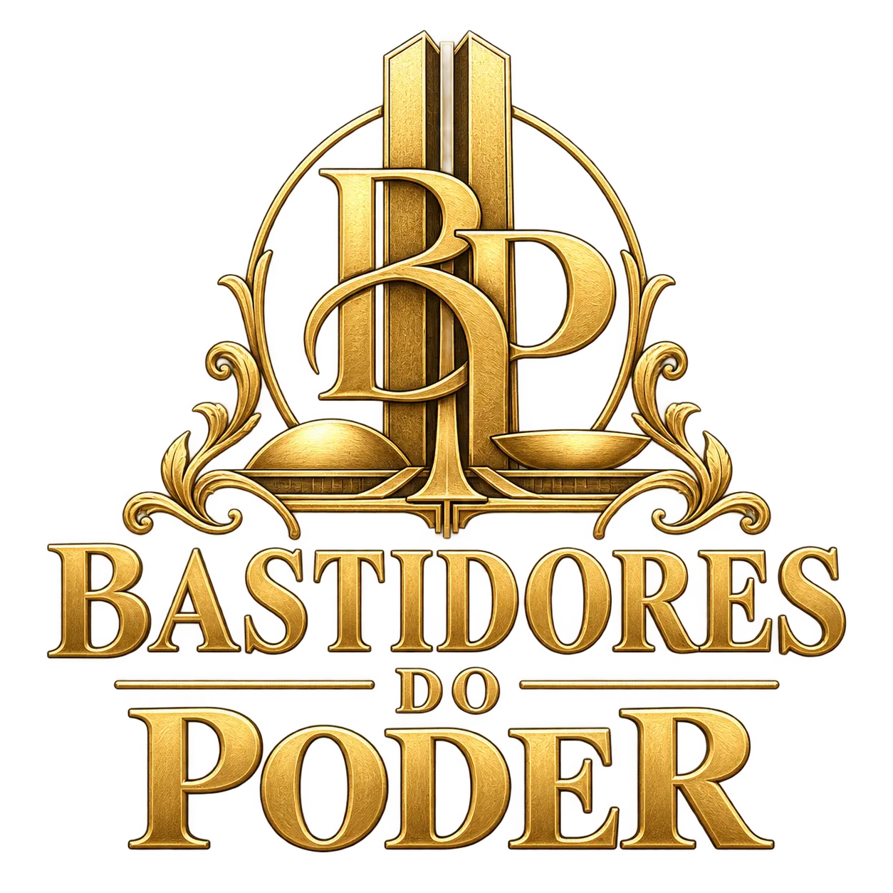

<div align="center">



# Bastidores do Poder

Jogo de cartas de blefe ambientado nos corredores de Brasília, para 2 a 8 jogadores.

[](https://github.com/ajotanc/bastidoresdopoder/actions/workflows/quality.yml)


[Manual](https://bastidoresdopoder.ajotanc.com.br) · [Jogar online](https://bastidoresdopoder.ajotanc.com.br/game) · [Arquitetura online](BDP.md)


</div>

## Como se joga

Cada jogador começa com dois apoios, que são cartas secretas, e C$ 2. No seu turno você escolhe uma ação. Algumas qualquer um pode fazer. Outras exigem um personagem, e aí você pode dizer que tem a carta mesmo sem ter.

Quem desconfia contesta. Se você estava blefando, perde um apoio. Se tinha a carta, quem contestou é que perde. Quem fica sem apoios está fora, e ganha o último que sobrar na mesa.

A moeda do jogo é o Conto (C$). Quem começa o turno com C$ 10 ou mais é obrigado a usar o Impeachment definitivo, que não tem bloqueio nem contestação.

## Personagens

O baralho tem 24 cartas, três de cada personagem.

| | Personagem | Ação | Defesa |
|:---:|---|---|---|
|  | **Coronel** | Extorsão: pega até C$ 2 de um adversário | Bloqueia Extorsão e Mandado quando é o alvo |
|  | **Executor** | Execução: paga C$ 3 e o alvo perde 1 apoio | Nenhuma |
|  | **Intocável** | Nenhuma | Paga C$ 3 para bloquear o Impeachment comum |
|  | **Advogada** | Nenhuma | Bloqueia Execução e Mandado quando é o alvo |
|  | **Barão** | Caixa 2: recebe C$ 3 do cofre | Bloqueia a Vaquinha Virtual de qualquer jogador |
|  | **Marqueteira** | Troca de Cartas: compra 2 e devolve 2 | Bloqueia Extorsão quando é o alvo |
|  | **Investigador** | Mandado de Busca: paga C$ 5 e procura um personagem na mão do alvo | Nenhuma |
|  | **Articuladora** | Acordo de Bastidor: recebe C$ 2 e dá C$ 1 do cofre a outro jogador | Nenhuma |

As ações gerais (Salário Oficial, Vaquinha Virtual e os dois Impeachments) não exigem personagem. As regras completas, com exemplos de mesa, estão no manual do site.

## O que tem no projeto

O site tem duas partes. O manual explica as regras com cartas ampliáveis, busca por personagem, tabela de bloqueios e casos resolvidos passo a passo. Funciona offline depois de instalado como PWA.

O modo online roda direto no navegador, sem cadastro. Quem cria a sala vira o anfitrião e manda o código ou o link para os outros. As partidas são peer to peer via PeerJS: o navegador do anfitrião executa as regras e os outros se conectam a ele, sem servidor de jogo no meio. Se faltar gente, dá para completar a mesa com bots em quatro níveis (fácil, intermediário, difícil e pro). Os bots só enxergam a própria mão e o que aconteceu em público na mesa.

Também dá para abrir uma sala de voz no Discord para a partida e registrar o resultado em um canal. Isso é opcional e usa Netlify Functions.

## Tecnologias

- Vue 3, TypeScript, Vite e Pinia
- Tailwind CSS, Radix Vue e ícones Lucide
- PeerJS (WebRTC) para o modo online
- Netlify para hospedagem e Functions da integração com o Discord
- Vitest e Playwright para os testes

## Rodando localmente

Precisa de Node.js 24 e pnpm 11.19.0 (a versão está em `packageManager`).

```sh
pnpm install --frozen-lockfile
pnpm dev
```

O manual funciona sem configurar nada. Para o modo online, copie `.env.example` para `.env` e preencha o servidor PeerJS e, se quiser, as credenciais TURN. As variáveis do Discord só são necessárias para a sala de voz.

Os parâmetros do jogo ficam em `game.config.json`: número de jogadores, saldo inicial, tempos de ação e de resposta e comportamento dos bots.

## Testes

```sh
pnpm lint
pnpm test        # testes unitários (Vitest)
pnpm build
pnpm test:e2e    # testes de navegador (Playwright)
```

Os testes de navegador rodam sobre o build, então rode `pnpm build` antes. Três deles usam o servidor PeerJS real e só rodam com `BDP_LIVE_PEER_TEST=1`. Com `BDP_LIVE_TIMEOUT_TEST=1`, o teste de conexão também espera os prazos estourarem de verdade, o que leva alguns minutos.

O workflow `.github/workflows/quality.yml` roda lint, testes unitários, build e testes de navegador em todo push na `main` e em pull requests.

## Estrutura

```
src/
├── components/
│   ├── game/        seções do manual
│   ├── online/      lobby, mesa e modais do modo online
│   └── ui/          componentes reutilizáveis
├── constants/       personagens, regras, exemplos e configuração
├── game/
│   ├── engine/      regras da partida, independentes de Vue e PeerJS
│   ├── bots/        estratégia e níveis dos bots
│   └── models/      estado, comandos e validação
├── online/          conexão PeerJS, salas e reconexão
└── stores/          estado da sessão (Pinia)
netlify/functions/   integração com o Discord
```

## Documentação

- [BDP.md](BDP.md): arquitetura do modo online, protocolo e fluxo das jogadas
- [docs/auditoria-regras-peerjs.md](docs/auditoria-regras-peerjs.md): auditoria das regras e da arquitetura
- [docs/session-protection.md](docs/session-protection.md): proteção e recuperação da sessão
- [docs/discord-voice.md](docs/discord-voice.md): conversa de voz no Discord
- [docs/match-results.md](docs/match-results.md): encerramento e revanche
- [docs/type-safety.md](docs/type-safety.md): tipagem e dados externos
- [src/game/bots/README.md](src/game/bots/README.md): como os bots decidem

## Status

O jogo está em fase de testes de equilíbrio, então regras e valores ainda podem mudar. Relatos de partidas e sugestões podem ser registrados nas issues.

---

<div align="center">

Feito por [AJOTA](https://www.instagram.com/ajotanc/)

</div>
